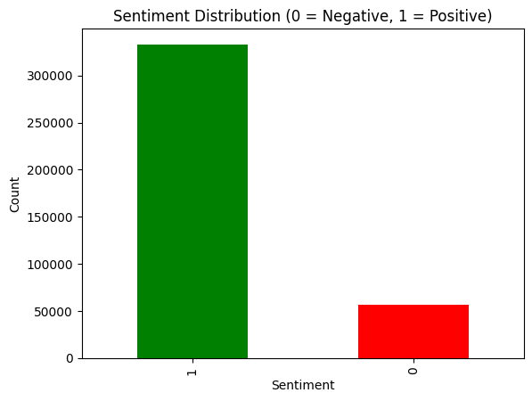

<div align="center">

# 💬 Customer Review Sentiment Classifier

### *Automated sentiment analysis using Natural Language Processing and Machine Learning*

[](https://your-app-name.streamlit.app)
[](https://www.python.org/downloads/)
[](LICENSE)

**Classify customer reviews as Positive 😊 or Negative 😞 with machine learning**

</div>

---

## 📖 Overview

This project demonstrates end-to-end **Natural Language Processing (NLP)** for sentiment classification:

🔹 **Data Cleaning** – Preprocesses raw customer review text  
🔹 **Feature Extraction** – Converts text to numerical features using TF-IDF  
🔹 **Model Training** – Trains a Logistic Regression classifier  
🔹 **Deployment** – Interactive web app built with Streamlit  

Built as a practical application of **supervised machine learning** for real-world customer feedback analysis.

---

## 📊 Dataset

| Attribute | Details |
|-----------|---------|
| **Source** | [Amazon Fine Food Reviews (Kaggle)](https://www.kaggle.com/datasets/snap/amazon-fine-food-reviews) |
| **Original Size** | ~500,000 reviews |
| **After Cleaning** | ~400,000 reviews |
| **Class Distribution** | 80% Positive 😊 / 20% Negative 😞 |

### Features Used
- **Text** – Raw customer review content
- **Score** – Original 1-5 star rating converted to binary sentiment:
  - ⭐⭐⭐⭐ / ⭐⭐⭐⭐ (3-5) → **Positive (1)**
  - ⭐ / ⭐⭐ (1-2) → **Negative (0)**

### Data Filtering
- Removed reviews shorter than **20 characters** (insufficient context)
- Removed reviews longer than **2000 characters** (outliers)

---

## 🧹 Data Cleaning (`01_data_cleaning.ipynb`)
Steps:
1. Load `Reviews.csv` from Kaggle  
2. Keep relevant columns (`Score`, `Text`)
3. Convert to binary sentiment labels
4. Apply text cleaning:
   - Lowercasing
   - Remove punctuation, digits, links, and extra spaces
5. Filter out too-short and too-long reviews
6. Save clean data → `data/clean_reviews.csv`

---

## ⚙️ Modeling (`02_vectorization_and_model.ipynb`)
### Pipeline:
1. **Split Data:** 80/20 train/test (stratified to preserve imbalance)
2. **Vectorization:** TF-IDF with 1–2 n-grams and English stopwords
3. **Model:** Logistic Regression (baseline)
4. **Evaluation:** Precision, Recall, F1-score, Confusion Matrix
5. **Improved Model:** `class_weight='balanced'` to handle class imbalance

---

## 📈 Results

| Model | Accuracy | F1-Negative | F1-Positive | Comment |
|-------|-----------|-------------|-------------|----------|
| Logistic Regression | ~0.86 | Low | High | Strong bias toward positive reviews |
| Logistic Regression (Balanced) | ~0.84 | ↑ Improved | Slight ↓ | Better recall for unhappy customers |

**Insight:**  
Balancing or weighting classes improves the model’s ability to identify *unhappy* customers, which is often more valuable in business contexts.

---

## 🧩 Key Visuals
- Confusion Matrix  
- Word importance analysis (top positive vs negative words)  
- Class distribution plots before/after balancing  

## 📸 Sample Images

### Results


### 📊 Sentiment Distribution


---

## 🌐 Streamlit Web App

<div align="center">

### 🚀 Try it Live!

The model is deployed as an **interactive web application** built with Streamlit.

**Features:**
- 📝 Paste any customer review
- ⚡ Get instant sentiment prediction
- 📊 View confidence scores
- 🎨 Clean, intuitive interface

</div>

---

## 🛠️ Technologies Used


---

## 📂 Project Structure

```
customer_reviews_classification/
│
├── data/
│   ├── Reviews.csv              # Raw dataset from Kaggle
│   └── clean_reviews.csv        # Cleaned and preprocessed data
│
├── notebooks/
│   ├── 01_data_cleaning.ipynb           # Data preprocessing pipeline
│   └── 02_vectorization_and_model.ipynb # Model training & evaluation
│
├── images/
│   ├── results.png
│   └── sentiment_distribution.png
│
├── README.md
└── requirements.txt
```

---

## 🚀 Getting Started

### Prerequisites
```bash
Python 3.8+
pip
```

### Installation

1. **Clone the repository**
```bash
git clone https://github.com/djalilsel/customer_reviews_classification.git
cd customer_reviews_classification
```

2. **Install dependencies**
```bash
pip install -r requirements.txt
```

3. **Download the dataset**
- Visit [Kaggle - Amazon Fine Food Reviews](https://www.kaggle.com/datasets/snap/amazon-fine-food-reviews)
- Download `Reviews.csv` and place it in the `data/` folder

- Start with `01_data_cleaning.ipynb`
- Then run `02_vectorization_and_model.ipynb`

---

## 👤 Author

**Djalil**

- GitHub: [@djalilsel](https://github.com/djalilsel)
- LinkedIn: [@abdeldjalilselamnia](https://www.linkedin.com/in/abdeldjalilselamnia/)
