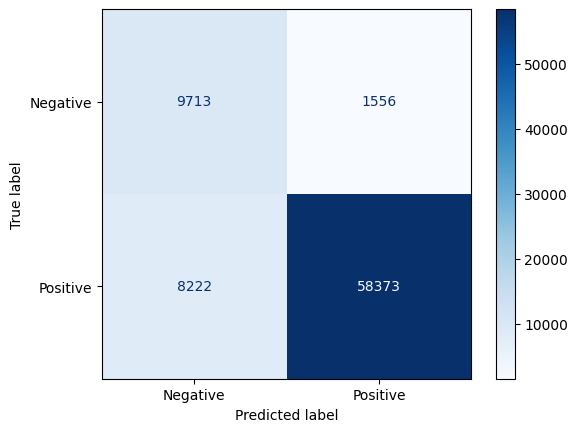

# 💬 Customer Review Sentiment Classifier

A Natural Language Processing (NLP) project that classifies customer reviews as **Positive (Happy)** or **Negative (Unhappy)** using machine-learning techniques.

---

## 🧠 Overview
This project takes raw customer review text, cleans and preprocesses it, then trains a machine-learning model to automatically detect sentiment.  
It’s built as a practical application of **supervised machine learning**, combining text cleaning, feature extraction (TF-IDF), and logistic regression classification.

---

## 📊 Dataset
- **Source:** [Amazon Fine Food Reviews on Kaggle](https://www.kaggle.com/datasets/snap/amazon-fine-food-reviews)
- **Size:** ~500,000 reviews
- **Features used:**
  - `Text` → the raw customer review
  - `Score` → original 1–5 rating converted into binary sentiment:
    - 4–5 → Positive (1)
    - 1–2 → Negative (0)
    - 3 → Neutral (removed)
- **After Cleaning:** ~400k reviews remain  
  - Short reviews (<20 chars) and overly long ones (>2000 chars) were removed.  
  - Roughly **80% positive** and **20% negative** balance was preserved.

---

## 🧹 Data Cleaning (`01_data_cleaning.ipynb`)
Steps:
1. Load `Reviews.csv` from Kaggle  
2. Keep relevant columns (`Score`, `Text`)
3. Convert to binary sentiment labels
4. Apply text cleaning:
   - Lowercasing
   - Remove punctuation, digits, links, and extra spaces
5. Filter out too-short and too-long reviews
6. Save clean data → `data/clean_reviews.csv`

---

## ⚙️ Modeling (`02_vectorization_and_model.ipynb`)
### Pipeline:
1. **Split Data:** 80/20 train/test (stratified to preserve imbalance)
2. **Vectorization:** TF-IDF with 1–2 n-grams and English stopwords
3. **Model:** Logistic Regression (baseline)
4. **Evaluation:** Precision, Recall, F1-score, Confusion Matrix
5. **Improved Model:** `class_weight='balanced'` to handle class imbalance

---

## 📈 Results

| Model | Accuracy | F1-Negative | F1-Positive | Comment |
|-------|-----------|-------------|-------------|----------|
| Logistic Regression | ~0.86 | Low | High | Strong bias toward positive reviews |
| Logistic Regression (Balanced) | ~0.84 | ↑ Improved | Slight ↓ | Better recall for unhappy customers |

**Insight:**  
Balancing or weighting classes improves the model’s ability to identify *unhappy* customers, which is often more valuable in business contexts.

---

## 🧩 Key Visuals
- Confusion Matrix  
- Word importance analysis (top positive vs negative words)  
- Class distribution plots before/after balancing  

## 📸 Sample Images

### Results

### Sentiment Distribution

---

## 🌐 Streamlit Web App

The model is deployed as a simple **Streamlit** web app that allows users to paste a review and get an instant prediction (Positive or Negative).
**[Live Demo](https://customer-reviews-classification.streamlit.app)**
